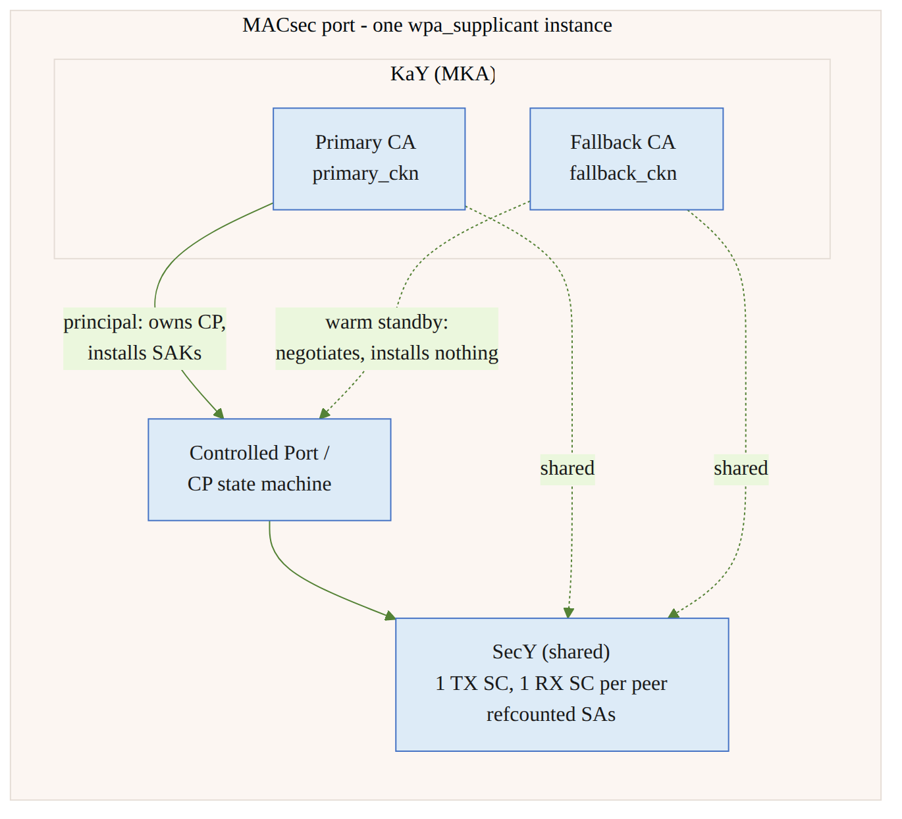
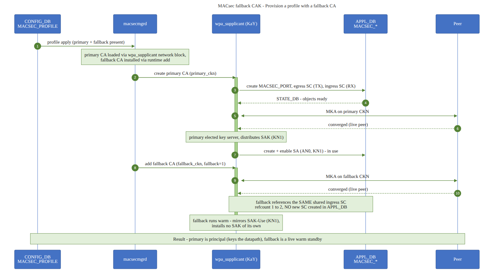
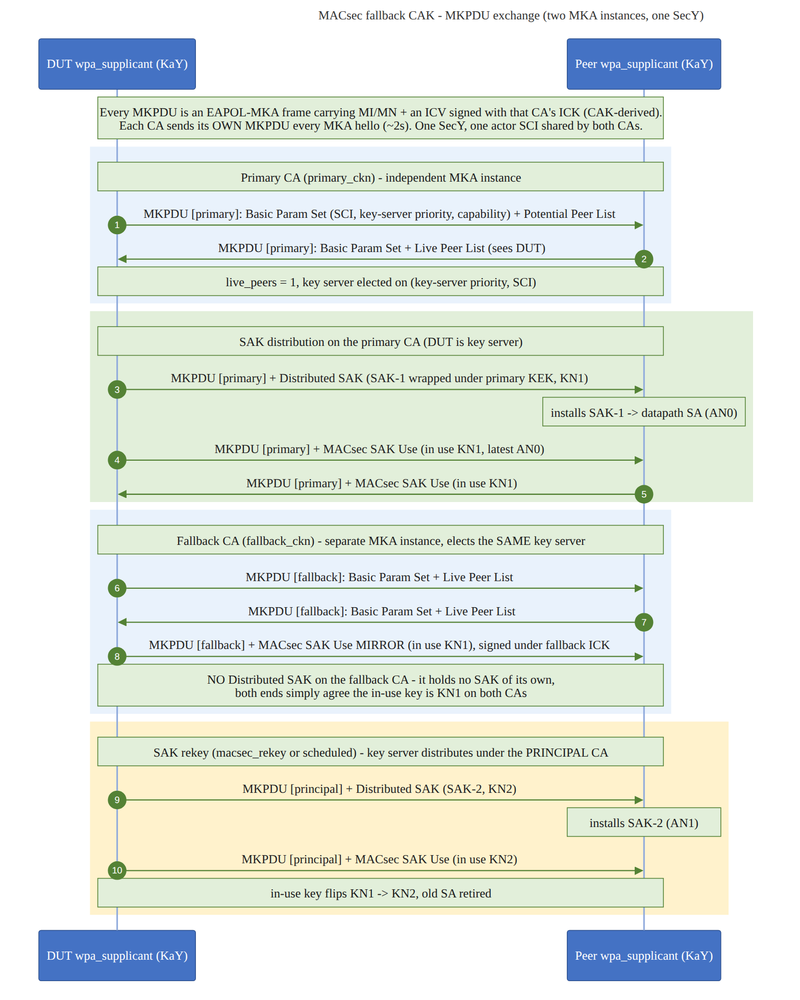
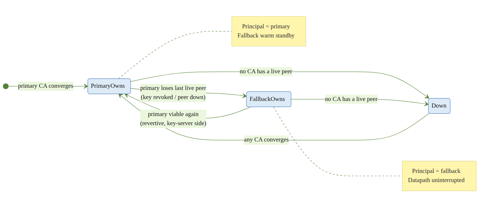
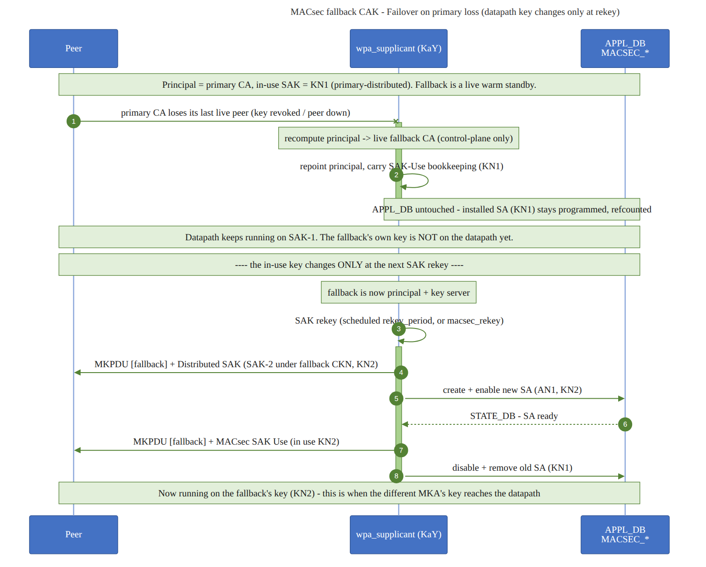
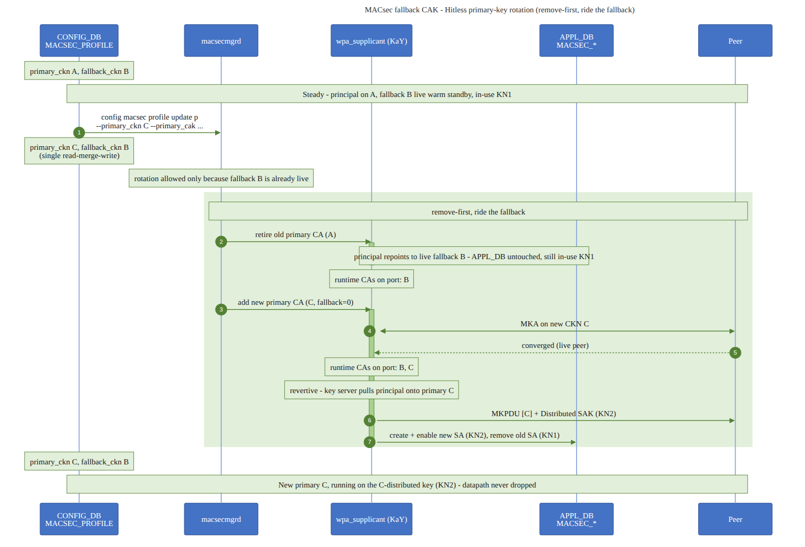

<!-- omit in toc -->
# MACsec Fallback CAK — SONiC High Level Design

***Revision***

|  Rev  | Date | Author        | Change Description |
| :---: | :--: | :------------ | ------------------ |
|  0.1  |      | Liam Kearney  | Initial version    |

<!-- omit in toc -->
## Table of Contents

- [Scope](#scope)
- [Abbreviations](#abbreviations)
- [1 Overview](#1-overview)
- [2 Design model](#2-design-model)
- [3 Configuration](#3-configuration)
  - [3.1 CONFIG\_DB schema](#31-config_db-schema)
  - [3.2 `config` command](#32-config-command)
- [4 Component behaviour](#4-component-behaviour)
  - [4.1 macsecmgrd](#41-macsecmgrd)
  - [4.2 wpa\_supplicant](#42-wpa_supplicant)
- [5 Control flow](#5-control-flow)
  - [5.1 Provisioning a profile with a fallback](#51-provisioning-a-profile-with-a-fallback)
  - [5.2 On-wire MKPDU exchange](#52-on-wire-mkpdu-exchange)
  - [5.3 Principal ownership lifecycle](#53-principal-ownership-lifecycle)
  - [5.4 Failover on primary loss](#54-failover-on-primary-loss)
  - [5.5 Hitless primary-key rotation](#55-hitless-primary-key-rotation)
- [6 Design invariants](#6-design-invariants)
- [7 Validation plan](#7-validation-plan)
- [8 References](#8-references)

## Scope

This document describes the **fallback CAK** design for MACsec in SONiC. It is a
reference for the community and for vendors to check their own implementations
against. It is intentionally high-level and design-oriented: it states *what the
design guarantees* and *why*, and leaves per-repository implementation detail to
the code and its review.

This document builds on the base [MACsec HLD](MACsec_hld.md); familiarity with
MKA, the KaY, SecY, SCs, SAs, and the SONiC MACsec object model is assumed.

## Abbreviations

| Term | Meaning |
| ---- | ------- |
| CAK  | Connectivity Association Key |
| CKN  | CAK Name |
| CA   | Connectivity Association (one MKA participant / key context) |
| MKA  | MACsec Key Agreement protocol (IEEE 802.1X-2010) |
| KaY  | MKA entity ("Key agreement entity") in the supplicant |
| SecY | MAC Security Entity (the datapath cipher engine) |
| SC / SA | Secure Channel / Secure Association |
| SAK  | Secure Association Key (the per-SA data key derived under a CAK) |
| CP   | Controlled Port state machine |
| MKPDU | MKA Protocol Data Unit (the EAPOL-MKA frame each CA emits) |
| KN / AN | Key Number / Association Number identifying an installed SAK |
| ICV  | Integrity Check Value protecting an MKPDU (keyed by the per-CA ICK) |

## 1 Overview

A MACsec link is keyed by a **CAK**, identified by its **CKN**. Rotating that key
today is disruptive: the association is torn down and re-established, so the
datapath drops while the new key converges. The fallback-CAK design removes that
disruption and, more generally, lets an operator pre-stage a *second, standby*
key so that loss of the primary key — through revocation, expiry, or a peer
losing its copy — does not take the link down.

The design provisions **two CAKs on one port at once**: a **primary** and an
optional **fallback**. Both run their own MKA state machine but share one SecY.
Exactly one of them — the **principal** — owns the datapath at any instant. If
the primary's connectivity is lost, the port fails over to the fallback with no
datapath interruption, and reverts to the primary once it is viable again. The
same mechanism provides **hitless CAK rotation**: stage the new key alongside
the old, let it converge, then retire the old key.

**Behaviour in brief.** The change is enhanced **principal handling in
wpa_supplicant**:

- The **principal** owns the controlled port and generates/distributes the SAK;
  **preference is given to the primary** CA.
- On **loss of the current principal**, the **fallback inherits** the port.
- When the **primary is re-established**, keying **moves back** onto it.
- A node that is **not** the key server simply **matches whichever MKA the key
  server is distributing keys on** — it does not choose independently.
- **Both MKAs advertise SAK-Use for the same in-use SAK**, so both ends already
  agree on the key before any swap.
- The **hardware only ever sees SAK data keys**, and is updated on the regular
  **rekey interval / when required**. Fallback simply opens **another CA to
  distribute keys over**; it does not touch the datapath until the next rekey.

Goals:

- Add an optional fallback CAK/CKN to a MACsec profile.
- Fail over primary → fallback on loss of the primary, with no datapath drop.
- Revert fallback → primary automatically once the primary is viable again.
- Rotate the primary CAK/CKN hitlessly.
- Keep the on-wire protocol standard MKA — interoperable with any conformant peer.

Non-goals:

- More than two concurrent CAs per port.
- Any change to the MACsec cipher suites or the SecY datapath itself.

## 2 Design model

One MACsec port is served by one supplicant instance. Inside it, the **primary
CA** and the **fallback CA** each run an independent MKA state machine, but they
share a **single SecY** — one transmit SC and one receive SC per peer SCI. Only
the **principal** drives the Controlled Port and installs SAKs; the other CA runs
warm in the background, negotiating with the peer and mirroring the in-use SAK,
but installing nothing.



Because the SecY (and therefore the hardware SCs/SAs) is shared, moving the
principal from one CA to the other is a pure control-plane repoint: it does not
create, delete, or reprogram any hardware object. That is the property that makes
failover and rotation hitless.

## 3 Configuration

### 3.1 CONFIG_DB schema

The fallback CAK is expressed as two **optional** fields on the existing
`MACSEC_PROFILE` object:

```
MACSEC_PROFILE|<profile_name>
    "primary_cak":    "<hex>"      ; existing
    "primary_ckn":    "<hex>"      ; existing
    "fallback_cak":   "<hex>"      ; new, optional
    "fallback_ckn":   "<hex>"      ; new, optional
    ... (priority, policy, cipher_suite, ... unchanged)
```

Rules:

- A fallback CA is optional. When present, `fallback_cak` and `fallback_ckn` are
  required **together**.
- `fallback_ckn` must differ from `primary_ckn`.
- Removing the two fields from a profile is a first-class operation: it is
  observed as a real fallback removal, not a stale no-op.

### 3.2 `config` command

Operators manage fallback keys and rotation through `config macsec profile`;
editing CONFIG_DB directly is discouraged.

- `config macsec profile add <name> ... [--fallback_cak <hex> --fallback_ckn <hex>]`
  provisions a profile with an optional fallback CA from the start.
- `config macsec profile update <name> [--primary_cak/--primary_ckn]
  [--fallback_cak/--fallback_ckn] [--remove_fallback]` is the sanctioned way to
  rotate the primary key, change the fallback, or remove the fallback. It performs
  a read-merge-write so unrelated fields (priority, policy, cipher suite) are
  preserved.

The command validates paired fields, CKN collision (`fallback_ckn != primary_ckn`),
and CAK length for the profile's cipher suite. It also enforces the rotation guard
described in [§4.1](#41-macsecmgrd).

## 4 Component behaviour

### 4.1 macsecmgrd

`macsecmgrd` translates the CONFIG_DB profile into runtime CA state on the
supplicant:

- **Apply.** The primary CA is loaded when the profile is applied. If a fallback
  CKN/CAK is present, macsecmgrd additionally installs the fallback CA as a
  standby participant.
- **Hot update.** Adding, changing, or removing the fallback on a live profile is
  applied in place — no session restart.
- **Rotation guard.** A change to the *primary* CKN is only accepted when a
  fallback CA is already live (or when the new primary CKN equals the current
  fallback CKN, i.e. a promotion). This guarantees there is always a live CA to
  carry the port across the swap. A primary rotation with no live fallback is
  refused.
- **Remove-first rotation.** When a primary rotation is accepted, macsecmgrd
  retires the old primary CA *first* — the port immediately rides the already-live
  fallback — then installs the new primary CA. At most two CAs exist on the port
  at any moment; a third is never staged. See [§5.5](#55-hitless-primary-key-rotation).

### 4.2 wpa_supplicant

The supplicant owns the MKA/KaY control plane and the SecY. It exposes a small
runtime control interface (used by macsecmgrd) to add, remove, and list CAs and
to force a rekey, so that fallback provisioning and rotation are restart-free.
The design contract for that interface is:

| Operation | Effect |
| --------- | ------ |
| add CA `ckn=<hex> cak=<hex> [fallback=1]` | Register a new MKA participant. `fallback=1` marks it a standby role label only; a fallback CA remains fully eligible to become principal and key server. Duplicate CKN is rejected. |
| delete CA `ckn=<hex>` | Retire a participant. Re-runs election; if the deleted CA owned the port, the survivor takes over. |
| list CAs | Observability: per-CA CKN, principal/fallback role, live-peer count, key-server role, MI/MN. |
| rekey | Force a SAK refresh under the current principal CKN. Key-server-only; a silent no-op on a follower. |

Internally the supplicant:

- Runs both CAs off one SecY, and **refcounts** the shared receive SCs so that a
  principal swap never deletes an SC still in use by the other CA.
- Keeps a single **principal** pointer; all CP/SecY resolution goes through it, so
  the swap is an O(1) repoint.
- On a swap, re-homes only per-CA bookkeeping (SAK list, in-use SAK) to the new
  principal. The installed key and datapath are untouched.
- Follows the key server: a validated SAK distribution arriving on a non-principal
  CA hands port ownership to that CA. This is what makes both ends converge on the
  **same** CA even if their local primary/fallback labels are crossed — the key
  server's actual distribution draws the line, not local preference.
- Reverts to the primary only from the key-server side; a follower simply tracks
  whichever CA the key server distributes on.

The key server is elected per-CA on `(key_server_priority, SCI)`. Under the
supported symmetric configuration — a single per-port priority shared by both
CKNs, and one SecY SCI — both CAs elect the same key server, so a swap preserves
key-server identity. (A peer advertising divergent per-CKN priority is spec-legal;
in that case the hitless guarantee does not hold, see [§6](#6-design-invariants).)

## 5 Control flow

The sequence diagrams below use four lanes — **CONFIG_DB**, **macsecmgrd**,
**wpa_supplicant** (the KaY), and **APPL_DB** — plus a **Peer** lane where the
on-wire exchange matters. `APPL_DB` is the hardware boundary as seen by the
control plane: the SONiC MACsec plugin translates those writes into SAI/ASIC
programming (via MACsec Orch), which is unchanged by this feature and so is
omitted. A dashed return from `APPL_DB` stands for the `STATE_DB` readiness
confirmation.

### 5.1 Provisioning a profile with a fallback

Applying a `MACSEC_PROFILE` that carries a fallback CAK/CKN loads the primary CA
through the wpa_supplicant network block and then installs the fallback CA at
runtime as a warm standby. Only the primary drives the datapath.



### 5.2 On-wire MKPDU exchange

Each CA runs an independent MKA instance and emits its **own** MKPDU (an
EAPOL-MKA frame, ICV-protected by that CA's ICK). Every MKPDU carries the Basic
Parameter Set (actor SCI, key-server priority, MACsec capability), the
Live/Potential Peer Lists, and the MI/MN. The **key server's** MKPDU additionally
carries a *Distributed SAK*; every member advertises *MACsec SAK Use* naming the
SAK it currently transmits/receives on.

The important point is the fallback: it negotiates fully and **mirrors** the
in-use SAK's identity (KN/AN) in its own SAK-Use body — signed under its own
CAK/ICK — but it distributes **no** SAK and installs nothing. There is one
installed SAK on the port, distributed under the primary CKN; the fallback's own
key material only reaches the datapath at a subsequent rekey (see [§5.4](#54-failover-on-primary-loss)).



### 5.3 Principal ownership lifecycle

Principal ownership moves between the primary and fallback CAs in response to
live-peer topology, and the port is only torn down when *no* CA has a live peer.



### 5.4 Failover on primary loss

When the primary loses its last live peer (its key is revoked, expires, or the
peer drops it), the principal repoints to the live fallback CA. This is a
**control-plane-only** repoint: the shared SAs stay installed in `APPL_DB`
untouched, so the datapath keeps forwarding **on the existing SAK** and the
controlled port stays up.

The fallback's *own* key material does **not** take over the datapath at the
moment of failover. A shadow (non-principal) CA is **MKA-live but datapath-cold**:
while it was the standby it distributed and installed **no** SAK of its own.
Continuity across the swap therefore comes from **inheriting the primary's
already-installed SAK** — the promoted CA re-homes that in-use SAK as bookkeeping,
so the datapath never changes key at the instant of failover.

Because the promoted CA is now the key server for its CKN, it must eventually
issue a **fresh SAK under its own key** to fully retire the departed CAK's key
material. That rekey is **deferred out of the convergence transient**: the
promoted CA keeps running the inherited SAK across the swap, and only once both
ends have settled (a short hold on the order of a few MKA hello intervals) does
the key server distribute a new SAK, which the peer installs (new RX SA before TX
advances) so the change is hitless. The datapath key thus changes at that deferred
rekey — or at the ordinary scheduled `rekey_period` / operator `macsec_rekey` —
**not** at the moment of failover. The diagram makes this two-step nature
explicit: repoint first (no datapath change), new key later (at rekey).



### 5.5 Hitless primary-key rotation

Rotation is driven from CONFIG_DB. The precondition is a live fallback; the
persisted profile changes in a single write, and macsecmgrd's remove-first
sequence carries the port on the fallback while the new primary converges. The
diagram shows both the persisted `MACSEC_PROFILE` state and the runtime CA set at
each phase.



Adding a brand-new key as a fallback and then deleting the old primary is the same
machinery seen from the other direction: stage the new CA, let it converge, hand
the port to it, retire the old.

## 6 Design invariants

These are the properties an implementation must uphold; they are the useful
checklist for a vendor comparison.

1. **One SecY per port** — one transmit SC, one receive SC per peer SCI. A
   principal swap touches no hardware object.
2. **One principal at a time** — exactly one CA owns the Controlled Port and
   installs SAKs; the other is a warm standby.
3. **Refcount owns SC/SA lifetime** — shared receive SCs are refcounted across the
   two CAs so a swap never recreates or destroys an SC still in use. (The SONiC
   SAI object model keys SC rows by SCI with no refcount, so per-participant SC
   ownership would let one CA delete a row out from under the other — the refcount
   is a correctness requirement, not an optimisation.)
4. **Swaps are bookkeeping only** — moving the principal re-homes per-CA control
   state; it does not reprogram the installed key or the datapath.
5. **Principal follows the key server** — a validated SAK distribution defines the
   active CA, so crossed primary/fallback labels on the two ends still converge on
   one CA.
6. **Per-CA distribution validation** — each SAK distribution is validated by a
   self-contained per-CA key-server check before any shared state is touched, so
   the design is robust even to spec-legal per-CKN priority divergence
   (802.1X-2010 §9.5). Under that divergence a swap is not guaranteed hitless; the
   hitless guarantee is explicitly predicated on the shared-priority / shared-SCI
   symmetric configuration.
7. **Revert is key-server-side only** — revertive primary-preference is applied by
   the key server; a follower does not revert on its own.
8. **At most two CAs per port** — rotation is remove-first (retire old, ride the
   fallback, add new); a third CA is never staged.

## 7 Validation plan

Validation is owned by `sonic-mgmt`. The scope below describes *what* must be
proven, not a specific test implementation. Tests target a topology that supports
MACsec (e.g. t0) and assert datapath continuity with a tight loss tolerance
across every key transition.

**Provisioning and invariants**

- A profile with a fallback brings up **two** CAs sharing one SecY, with exactly
  **one** principal while any CA is live and the other carrying the standby role.
- Adding a fallback to a live profile, and removing it again, are hot operations
  that do not disturb the principal or the shared SC.
- A profile with a `fallback_ckn == primary_ckn` collision is rejected.
- Adding a duplicate CKN is rejected.

**Failover and revert**

- Tearing down the **primary** peer repoints the principal to the fallback, keeps
  the shared receive SC (no delete/recreate), and holds datapath loss within
  tolerance.
- Restoring the primary reverts the principal back to it (key-server side), while a
  follower simply tracks the key server's choice.
- Deleting the **non-principal** (standby) CA does not disturb the shared SC; only
  removing the last CA tears the port down.

**Rotation**

- A hitless primary CAK/CKN rotation via `config macsec profile update`, with a
  live fallback present, ends with the principal on the **new** CKN, never more
  than two CAs on the port, the shared receive SC preserved, and loss within
  tolerance.
- A primary rotation is **refused** when no live fallback exists (and a fallback
  set in the *same* command does not count — it is not live yet).
- Staging a new CKN as a fallback and deleting the old CKN performs a hitless
  rotation ending on the new key with one CA remaining.

**Regression**

- A single-CA profile (no fallback) behaves exactly as it does today.
- On-demand rekey under the current principal CKN remains hitless.

Both the `wpa_cli`-driven runtime path and the CONFIG_DB / `config macsec profile
update` path are exercised, since both are supported interfaces.

## 8 References

- [SONiC MACsec High Level Design](MACsec_hld.md)
- IEEE 802.1AE — MAC Security (MACsec)
- IEEE 802.1X-2010 — Port-Based Network Access Control (MKA)
